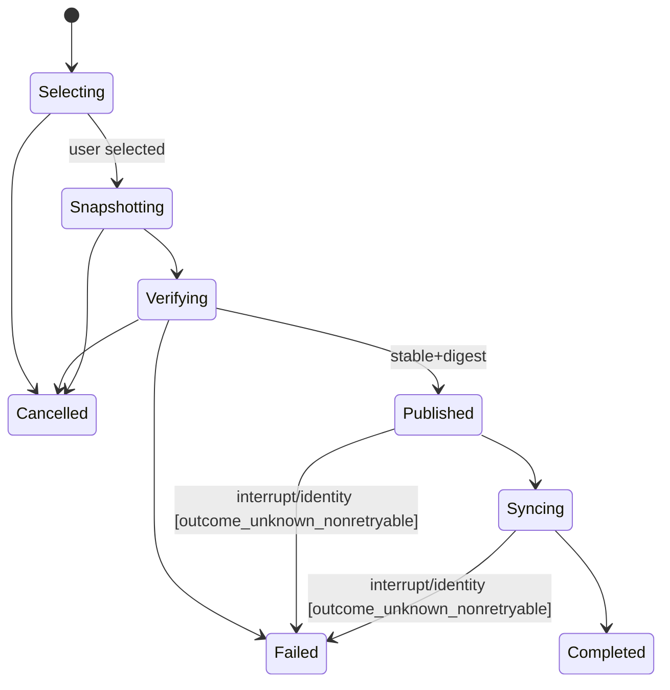
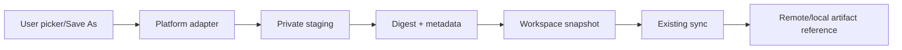

# PRD-LA-005: Archivos, attachments y artefactos

**Estado:** Ready
**Depende de:** LA-004
**Normativa:** RFC 2119/8174.

## Problema

Un agente remoto necesita recibir archivos elegidos por el usuario y devolver artefactos, pero conceder paths o filesystem local general rompe la frontera de confianza. El selector debe producir una copia inmutable, verificable y ligada a un workspace; el agente no debe conservar una ruta local como capability reutilizable.

## Objetivos

- **G5.1:** seleccionar/importar archivos mediante gesto humano y snapshot con digest.
- **G5.2:** guardar artefactos remotos mediante una copia sincronizada y Save As explícito.
- **G5.3:** impedir traversal, symlink escape, sustitución, fuga entre workspaces y consumo ilimitado.

## No-objetivos

No filesystem general, directory watching arbitrario, lectura silenciosa, path local entregado al remoto, acceso persistente, auto-open de downloads ni bypass del subsistema de sync existente.

## Contratos

```ts
interface FileSelectArgs {
  purpose: "attachment" | "workspace_import";
  accept: readonly { extension?: string; mediaType?: string }[];
  multiple: boolean;
  maximumFiles: number;
  maximumTotalBytes: number;
}

interface SelectedFileSnapshot {
  opaqueId: string;
  displayName: string;
  byteLength: number;
  sha256: string;
  workspaceRelativeSnapshotPath: string;
}

interface ArtifactSaveArgs {
  remoteArtifactId: string;
  expectedSha256: string;
  suggestedName: string;
  maximumBytes: number;
}
```

El selector devuelve metadatos sanitizados. El namespace publicado exacto es `.cuna-transfers/<workspaceBindingId>/<opaqueId>`; `opaqueId = H(workspaceBindingId,workspaceBindingGeneration,random128)`. Antes de leer, el broker consulta las reglas efectivas de exclusión y falla si ese path está ignorado. No usa `.cuna`, que el sync excluye de forma inmutable. El broker reserva presupuesto y copia primero a `.cuna-transfer-staging/<opaqueId>` en el mismo filesystem: esta raíz queda explícitamente fuera del watch/sync. Tras digest, fsync y cierre, rename atómico publica en `.cuna-transfers`; el sync nunca observa bytes parciales. En Windows esto requiere handle nativo con rechazo de reparse points e identidad pre/post; si no está disponible, la capacidad es `unsupported`. El sync existente es el único mecanismo que mueve la copia publicada entre local y remoto.

## Requisitos EARS

| ID | Requisito | Fuerza | Goal |
|---|---|---:|---|
| R5.1 | WHEN el usuario aprueba `file.select`, el adaptador SHALL abrir un picker nativo y SHALL leer sólo los archivos seleccionados en ese gesto. | MUST | G5.1 |
| R5.2 | WHEN se importa un archivo, el adaptador SHALL crear un snapshot privado con tamaño y SHA-256 antes de exponer un ID opaco. | MUST | G5.1, G5.3 |
| R5.3 | IF el objeto no es regular, cambia durante copia, excede presupuesto o cruza un symlink/reparse point, THEN el adaptador SHALL abortar, eliminar staging y devolver todo presupuesto reservado. | MUST | G5.3 |
| R5.4 | El resultado remoto SHALL NOT contener un path absoluto local. | MUST | G5.3 |
| R5.5 | WHEN se solicita `artifact.save`, el broker SHALL verificar artifact ID, workspace generation, digest y tamaño antes de mostrar Save As. | MUST | G5.2, G5.3 |
| R5.6 | WHEN el usuario elige destino, el adaptador SHALL escribir a temporal vecino y publicar con create-new; un overwrite requiere confirmación explícita separada. | MUST | G5.2 |
| R5.7 | IF cambia identidad o se cancela la acción, THEN el broker SHALL cerrar handles y eliminar temporales que creó. | MUST | G5.3 |
| R5.8 | WHERE una plataforma no tenga picker y primitive no-follow/reparse seguros, la capacidad SHALL ser `unsupported` antes de cualquier lectura. | MUST | G5.1 |
| R5.9 | IF `.cuna-transfers/<binding>/<opaqueId>` está excluido por reglas efectivas, THEN la importación SHALL fallar antes de seleccionar/copiar. | MUST | G5.1, G5.3 |
| R5.10 | WHILE un snapshot está incompleto, SHALL residir fuera del watch set; sólo un rename atómico SHALL hacerlo visible al sync. | MUST | G5.1, G5.3 |

## State machine y call/dataflow graph





## Causal, CSP/SMT y temporal logic

- Path pasado al agente → acceso posterior no consentido; mitigación: opaque ID + snapshot.
- Symlink/reparse point → escape; mitigación: no-follow, regular-file verification y reopen identity.
- Archivo cambia durante copia → digest no representa selección; mitigación: metadata pre/post y digest streaming.
- Cancelación → temporal huérfano; mitigación: ownership ledger + cleanup.

```text
snapshot.workspaceBindingGeneration = request.workspaceBindingGeneration
snapshot.bytes <= request.maximumTotalBytes
count(snapshots) <= request.maximumFiles
Published(snapshot) => sha256(snapshot.bytes)=snapshot.sha256
∀s1,s2: workspace(s1)!=workspace(s2) => opaqueId(s1)!=opaqueId(s2)
```

Petri net: tokens `picker(1)`, `file_slot(n)`, `byte_budget(B)`, `staging_owner`. P-invariantes: `picker_free+picker_active=1`; bytes reservados + libres = B; cada staging owner termina en `published` o `deleted`; `visible_to_sync -> published`.

LTL: `G(ReadLocalFile -> HumanSelectedSameAction)`, `G(Published -> DigestVerified ∧ CurrentWorkspaceGeneration)`, `G(Cancelled -> F NoOwnedTemporaries)`, `G(RemoteResult -> !ContainsAbsoluteLocalPath)`. Plan de BMC —no ejecutado todavía—: 2 workspaces, 3 archivos, symlink swap, content mutation, duplicate ID, cancelación en cada paso y límites exactos ±1. No se afirma ausencia de contraejemplos sin ejecución reproducible.

## Aceptación

- **Given** un archivo regular seleccionado, **When** se importa, **Then** el snapshot coincide byte por byte y por SHA-256.
- **Given** un symlink o reparse point, **When** se selecciona, **Then** falla sin snapshot.
- **Given** el archivo cambia durante copia, **When** se verifican metadatos, **Then** falla y limpia staging.
- **Given** una copia incompleta, **When** el watcher de sync enumera cambios, **Then** no observa el staging; sólo aparece tras rename atómico.
- **Given** dos workspaces, **When** importan archivos con igual nombre, **Then** no comparten ID ni path de snapshot.
- **Given** un artifact digest distinto, **When** se intenta Save As, **Then** no aparece picker de destino.
- **Given** cancelación, **When** termina cleanup, **Then** no quedan temporales creados por la acción.

## Trazabilidad

| Goal | Req | Diseño | Tarea | Test |
|---|---|---|---|---|
| G5.1 | R5.1–R5.2, R5.8–R5.10 | picker + snapshot | T5-select | TC5-picker, TC5-digest, TC5-ignored-path, TC5-no-partial-sync |
| G5.2 | R5.5–R5.6 | artifact verifier + Save As | T5-save | TC5-save, TC5-no-overwrite |
| G5.3 | R5.3–R5.7, R5.9–R5.10 | no-follow, binding, cleanup | T5-isolation | TC5-symlink, TC5-race, TC5-cross-workspace, TC5-no-partial-sync |

## Calidad

Puntuación re-auditada: 2+2+2+2+1+1+2+2+1 = **15/18**. Límites de archivos/bytes, digests y cleanup son métricas verificables; los módulos están aislados y Windows permanece `unsupported`, por lo que no se anuncian desde foreground.
