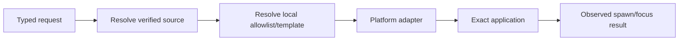
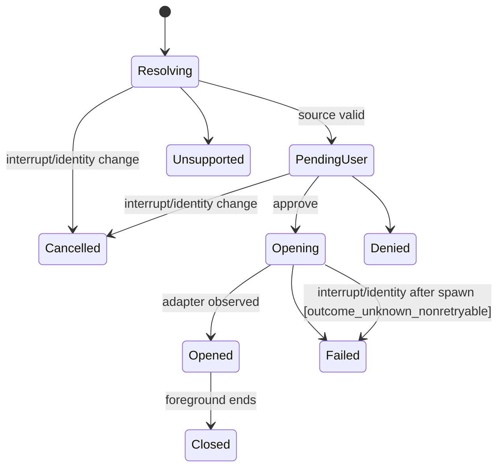

# PRD-LA-006: Preview, diff, editor y notificaciones

**Estado:** Ready
**Depende de:** LA-005
**Normativa:** RFC 2119/8174.

## Problema

Mostrar resultados remotos en aplicaciones locales reduce fricción, pero una URI o comando entregado por el agente equivale a ejecución local. Preview, diff, editor y notificaciones requieren entradas derivadas de artefactos verificados o port forwards privados, y destinos seleccionados por CUNA mediante allowlists cerradas.

## Objetivos

- **G6.1:** abrir previews/diffs de contenido conocido sin URL o comando arbitrario.
- **G6.2:** abrir un workspace remoto con un editor instalado y allowlisted.
- **G6.3:** mostrar notificaciones sólo durante la sesión foreground y con contenido seguro.

## No-objetivos

No browser automation, arbitrary URI/app/command, ejecución de archivos descargados, plugins de editor automáticos, persistencia background, captura de pantalla ni notificaciones tras detach.

## Contratos

```ts
type EditorId = "vscode" | "cursor" | "windsurf" | "zed" | "jetbrains-gateway";

interface PreviewOpenArgs {
  source: { kind: "artifact"; opaqueId: string; sha256: string }
        | { kind: "private_forward"; streamId: string };
  mediaType: string;
}
interface DiffOpenArgs { leftArtifactId: string; rightArtifactId: string; expectedDigests: readonly [string,string]; }
interface EditorOpenArgs {
  editor: EditorId; connectionDescriptorId: string;
  workspaceBindingId: string; workspaceBindingGeneration: number;
}
interface NotificationArgs { category: "action_required" | "task_complete" | "task_failed"; title: string; body: string; focusRequestId: string; }
```

El `connectionDescriptorId` se resuelve localmente a una plantilla fija por editor. `DescriptorBinding=(workspaceBindingId,workspaceBindingGeneration)` debe coincidir con el envelope vivo. El registro guarda el path absoluto verificado del executable: no se busca en `PATH`. Ningún argumento remoto contiene executable, flags, URI o shell text.

Notificaciones se deduplican por `(agentSessionId,category,focusRequestId)` durante 60 segundos y se limitan por sesión a burst 3 y luego una cada 10 segundos. Exceso produce resultado `rate_limited`, no una cola diferida.

## Requisitos EARS

| ID | Requisito | Fuerza | Goal |
|---|---|---:|---|
| R6.1 | WHEN se aprueba un preview/diff, el adaptador SHALL resolver únicamente un artifact verificado o private forward vivo. | MUST | G6.1 |
| R6.2 | IF media type, digest, stream o workspace generation no coincide, THEN el adaptador SHALL NOT abrir aplicación. | MUST | G6.1 |
| R6.3 | WHEN se abre editor, el adaptador SHALL seleccionar un executable absoluto y argumentos desde una plantilla local allowlisted por `EditorId`, sin búsqueda en `PATH`. | MUST | G6.2 |
| R6.4 | El request remoto SHALL NOT proporcionar executable, flags, URI scheme o path absoluto local. | MUST | G6.2 |
| R6.5 | WHERE el editor no esté instalado o verificado, la capacidad SHALL devolver `unsupported` sin fallback a shell. | MUST | G6.2 |
| R6.6 | WHILE el CLI foreground posee la sesión, `notification.show` SHALL mostrar sólo texto sanitizado y una acción de foco al request exacto. | MUST | G6.3 |
| R6.7 | WHEN el foreground termina, el adaptador SHALL impedir nuevos efectos, cancelar actions pendientes y SHALL NOT dejar helper persistente; MAY intentar retirar best-effort un toast ya entregado. | MUST | G6.3 |
| R6.8 | El preview SHALL derivar media type desde bytes/allowlist, no desde el valor remoto; HTML/SVG SHALL renderizarse como texto salvo que exista un renderer local estático con scripts, red, forms y navegación deshabilitados y CSP fija. | MUST | G6.1 |
| R6.9 | WHEN una notificación duplica su clave dentro de 60 segundos o supera burst 3/una cada 10 segundos, el adaptador SHALL devolver `rate_limited` sin nuevo toast. | MUST | G6.3 |

## CFG/call graph y state machine



CFG: `validate identity → resolve opaque source → reverify digest/forward → choose fixed adapter → sanitize presentation → user consent → spawn exact argv array → observe process handoff → result`. No paso construye un command string.



## Causal/formal

- Remote URI → arbitrary app/protocol handler; mitigación: opaque descriptor + fixed template.
- Active artifact → local code; mitigación: media derivado de bytes + texto por defecto o renderer local estático sin scripts/red/forms/navigation y CSP fija.
- Notification spoofing → user confusion; mitigación: CUNA branding, category enum y sanitized bounded text.

```text
Spawn(app,argv) => app=LocalAllowlist[EditorId].absoluteExecutable
                 ∧ argv=LocalAllowlist[EditorId].render(VerifiedDescriptor)
Preview(source) => VerifiedArtifact(source) XOR LivePrivateForward(source)
DescriptorBinding = (workspaceBindingId, workspaceBindingGeneration)
Notification => ForegroundAlive ∧ len(title)<=80 ∧ len(body)<=240
toasts(session,10s) <= 1 after initialBurst(3)
```

LTL: `G(AppSpawn -> Approved ∧ AbsoluteAllowlistedTemplate)`, `G(NotificationEffect -> ForegroundAlive)`, `G(ActiveContent -> StaticRenderer ∨ RenderedAsText)`, `G(ForegroundEnded -> G !NewNotificationEffect)`, `G(ForegroundEnded -> F NoNotificationHelper)`. CTL: `AG(Recoverable -> AF Idle)` bajo fairness.

Plan de BMC —no ejecutado todavía—: 5 editors, installed/missing ambiguity, hostile names/control characters, stale digests, expired forward, duplicados/rate window, concurrent focus actions y Ctrl-C. El modelo SHALL volver UNSAT `Spawn ∧ (ArbitraryExecutable ∨ ArbitraryArgv)` y `ToastEffect ∧ ¬RatePermit`; no se afirma ese resultado sin artefacto y ejecución reproducibles.

## Aceptación

- **Given** un artifact con digest válido, **When** el usuario abre preview, **Then** se usa sólo la copia verificada.
- **Given** HTML activo sin sandbox disponible, **When** se abre, **Then** aparece como texto y no ejecuta scripts.
- **Given** un editor no instalado, **When** se selecciona, **Then** devuelve `unsupported` sin abrir shell.
- **Given** un request con URI o executable, **When** se valida, **Then** se rechaza por schema.
- **Given** una notificación y foreground cerrado, **When** intenta mostrarse, **Then** no ocurre efecto.

## Trazabilidad

| Goal | Req | Diseño | Tarea | Test |
|---|---|---|---|---|
| G6.1 | R6.1–R6.2, R6.8 | verified source + media policy | T6-preview | TC6-artifact, TC6-active |
| G6.2 | R6.3–R6.5 | editor templates | T6-editor | TC6-allowlist, TC6-missing |
| G6.3 | R6.6–R6.7, R6.9 | foreground notifier | T6-notify | TC6-sanitize, TC6-detach, TC6-rate-dedupe |

## Calidad

Puntuación re-auditada: 2+2+2+2+1+1+2+2+1 = **15/18**. Las cotas de texto, deduplicación y rate limit son métricas verificables; “Opened” prueba sólo handoff del SO y el wiring foreground sigue pendiente.
