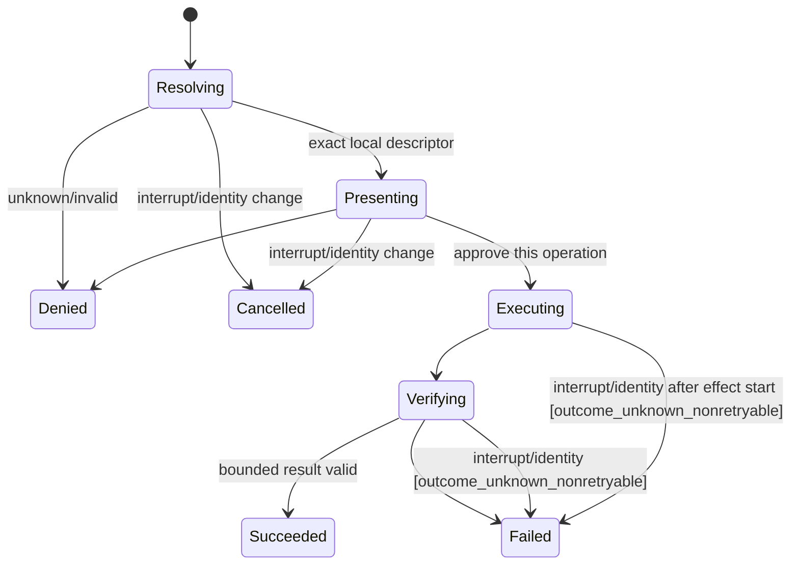
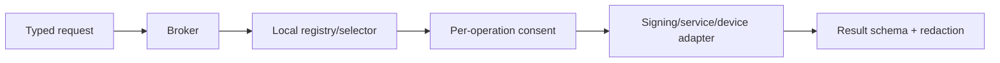

# PRD-LA-007: Firma, servicios locales y selección de dispositivos

**Estado:** Ready
**Depende de:** LA-006
**Normativa:** RFC 2119/8174.

## Problema

Firma Git, servicios developer locales y dispositivos pueden aportar valor, pero son las capacidades de mayor riesgo: una interfaz genérica se convertiría en credential oracle, proxy a la red local o acceso permanente a hardware. Sólo son aceptables como operaciones pequeñas, tipadas, presentadas al usuario y sin exportar handles reutilizables.

## Objetivos

- **G7.1:** firmar únicamente payloads canónicos de commit/tag con aprobación por operación.
- **G7.2:** llamar sólo endpoints loopback registrados con método/path/schema fijos.
- **G7.3:** permitir selección humana de dispositivo y devolver metadatos opacos mínimos.

## No-objetivos

No raw signing oracle, agent forwarding SSH/GPG, lectura/export de keys, acceso keychain, HTTP genérico, redirects, scanning LAN/USB/Bluetooth, lectura/escritura arbitraria de dispositivos, montaje, captura de audio/video/pantalla ni grants persistentes para operaciones sensibles.

## Contratos

```ts
interface GitSignArgs {
  objectType: "commit" | "tag";
  canonicalPayloadBase64url: string;
  decodedLength: number;
  payloadSha256: string;
  keySelectorId: string;
}
interface GitSignResult {
  signatureBase64url: string;
  decodedLength: number;
  signatureSha256: string;
  algorithm: string;
  publicKeyFingerprint: string;
}
interface LocalServiceArgs {
  registrationId: string;
  operationId: string;
  bodyEncoding: "canonical_json" | "base64url";
  body: unknown | string;
  decodedLength: number;
  bodySha256: string;
}
interface LocalServiceResult {
  outcome: "ok" | "service_error" | "timeout";
  bodyEncoding: "canonical_json" | "base64url";
  body: unknown | string;
  decodedLength: number;
  bodySha256: string;
}
interface DeviceSelectArgs {
  deviceClass: "serial" | "usb" | "camera" | "microphone";
  purpose: string;
  requestedMetadata: readonly ("display_name" | "class" | "capabilities")[];
}
```

Todos los bytes RTP1 se representan como base64url canónico sin padding, `decodedLength` exacto y SHA-256 sobre bytes decodificados; longitud y encoding se validan antes de reservar memoria o decodificar. Los registros de servicios y key selectors son locales, user-owned y no contienen secretos. Cada `operationId` resuelve IP loopback literal, método, path, request/response encoding+schema, límites, timeout e idempotencia. El cliente ignora variables proxy y no usa DNS, Unix sockets o redirects. `device.select` devuelve un `opaqueDeviceId` sólo para correlacionar ese resultado; expira al terminar el request y ninguna otra operación de esta suite lo acepta.

## Requisitos EARS

| ID | Requisito | Fuerza | Goal |
|---|---|---:|---|
| R7.1 | WHEN se solicita firma, el broker SHALL verificar object type, formato canónico, digest, identidad y consentimiento específico antes de usar el signer local. | MUST | G7.1 |
| R7.2 | El signer SHALL devolver sólo signature, algoritmo y public key fingerprint; SHALL NOT exportar key material o agent handles. | MUST | G7.1 |
| R7.3 | IF el payload no es un commit/tag canónico o cambia tras consentimiento, THEN la firma SHALL fallar sin invocar la key. | MUST | G7.1 |
| R7.4 | WHEN se solicita un servicio local, el broker SHALL resolver `registrationId+operationId` a IP loopback literal, método, path, encodings y schemas exactos. | MUST | G7.2 |
| R7.5 | El cliente de servicio SHALL ignorar proxy env, SHALL NOT usar DNS, Unix sockets o redirects y SHALL aplicar límites de body/response, timeout y content type. | MUST | G7.2 |
| R7.6 | WHEN se solicita dispositivo, el SO SHALL mostrar su selector y el broker SHALL devolver sólo el dispositivo elegido y metadatos solicitados/permitidos. | MUST | G7.3 |
| R7.7 | IF no hay gesto humano, el dispositivo desaparece o cambia identidad, THEN el handle opaco SHALL quedar inválido antes de uso. | MUST | G7.3 |
| R7.8 | WHILE la operación sea sensible, la política SHALL requerir consentimiento por operación y SHALL NOT ofrecer “always allow”. | MUST | G7.1–G7.3 |
| R7.9 | WHEN se transportan bytes, el receptor SHALL validar base64url canónico, decoded length, digest y límite antes de reservar/decodificar. | MUST | G7.1, G7.2 |
| R7.10 | IF un servicio no está marcado explícitamente idempotente, THEN el broker SHALL NOT reintentar automáticamente. | MUST | G7.2 |
| R7.11 | El `opaqueDeviceId` SHALL ser sólo correlación del resultado de selección, expirar al terminar ese request y SHALL NOT autorizar read/write u otra operación. | MUST | G7.3 |
| R7.12 | WHEN un servicio responde, el broker SHALL validar encoding, schema, decoded length, digest y límite antes de devolver `LocalServiceResult`. | MUST | G7.2 |

## State machine, call graph y behavior tree





```text
Selector(
  Sequence(resolveExactDescriptor, revalidateIdentity, consentOnce,
           executeBounded, validateResult, revokeHandle),
  Sequence(cancelOperation, revokeHandle, redactFailure)
)
```

## CSP/SMT, Petri y temporal logic

```text
Sign(p) => CanonicalGitObject(p) ∧ DigestMatches(p) ∧ ConsentForDigest(p)
ServiceCall(r) => r.host ∈ {127.0.0.1,::1}
                  ∧ r.method=Registry.method ∧ r.path=Registry.path
                  ∧ NoProxy ∧ NoDNS ∧ NoRedirect ∧ NoUnixSocket
DeviceUse(h) => HumanSelected(h) ∧ ForegroundAlive ∧ CurrentIdentity(h)
SensitiveGrantLifetime = one operation
RedirectCount = 0
Retry(r) => Registry[r.operationId].idempotent=true
```

Petri tokens: `signer(1 per selector)`, `service_slot(n per registration)`, `device_handle(1 per selection)`, `consent_slot(1 global)`. Invariantes: `signer_free+signing=1`; `handle_free+handle_live=1` por selección (revoke consume live y devuelve free; `revoked` es sólo un hecho); result count ≤1 por request.

LTL: `G(Sign -> ConsentForSameDigest)`, `G(ServiceEffect -> ExactRegistration)`, `G(DeviceUse -> HumanSelected ∧ ForegroundAlive)`, `G(OperationTerminal -> F HandleRevoked)`, `G(SensitiveAction -> !PersistentGrant)`. CTL: `AG(Recoverable -> AF Idle)` bajo fairness.

Plan de bounded model checking —no ejecutado todavía—: 2 sesiones, 2 digests, 2 keys, 2 service operations y 2 device handles; intercalar cambio de digest, redirect, oversized body, unplug, detach y Ctrl-C. Buscar firma de digest distinto, request fuera de registry, handle reutilizado o respuesta cruzada; no se afirma ausencia de contraejemplos sin ejecución reproducible.

## Aceptación

- **Given** un commit canónico aprobado, **When** se firma, **Then** la firma verifica contra fingerprint retornado y no se exporta key material.
- **Given** el payload cambia tras consentimiento, **When** llega al signer, **Then** la operación falla.
- **Given** un servicio registrado, **When** responde redirect, **Then** no se sigue.
- **Given** proxy env o un hostname, **When** se prepara la llamada, **Then** se ignora el proxy y se rechaza el destino no literal.
- **Given** response con digest/longitud inválidos, **When** se valida, **Then** no se entrega al agente.
- **Given** un request a método/path no registrados, **When** se valida, **Then** no se abre socket.
- **Given** dos dispositivos, **When** el usuario elige uno, **Then** sólo retorna su opaque ID y metadatos permitidos.
- **Given** detach o unplug, **When** se intenta reutilizar el opaque ID, **Then** se rechaza antes del acceso.

## Trazabilidad

| Goal | Req | Diseño | Tarea | Test |
|---|---|---|---|---|
| G7.1 | R7.1–R7.3, R7.8–R7.9 | canonical signer | T7-sign | TC7-digest, TC7-no-export, TC7-wire-bytes |
| G7.2 | R7.4–R7.5, R7.8–R7.10, R7.12 | exact service registry | T7-service | TC7-path, TC7-redirect, TC7-bounds, TC7-no-retry, TC7-response |
| G7.3 | R7.6–R7.8, R7.11 | OS selector + result correlation ID | T7-device | TC7-select, TC7-unplug, TC7-detach |

## Calidad

Puntuación re-auditada: claridad 2, completitud 2, consistencia 2, verificabilidad 2, factibilidad 1, trazabilidad 1, problem-first 2, no-goals 2, métricas 1 = **15/18**. Límites de payload, retries, handles y consentimientos son métricas verificables; las acciones permanecen no anunciadas hasta wiring y prueba runtime por SO.
